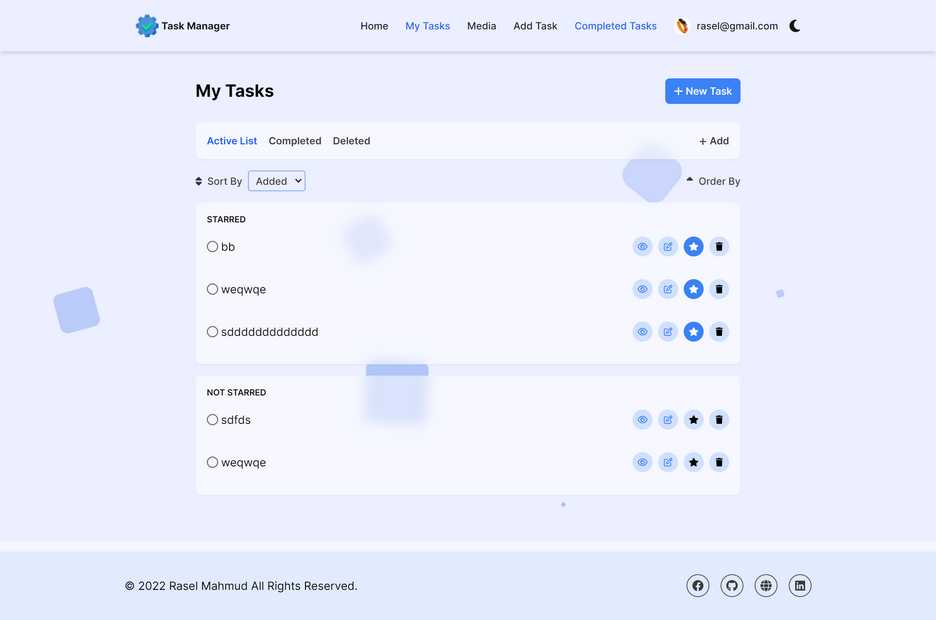
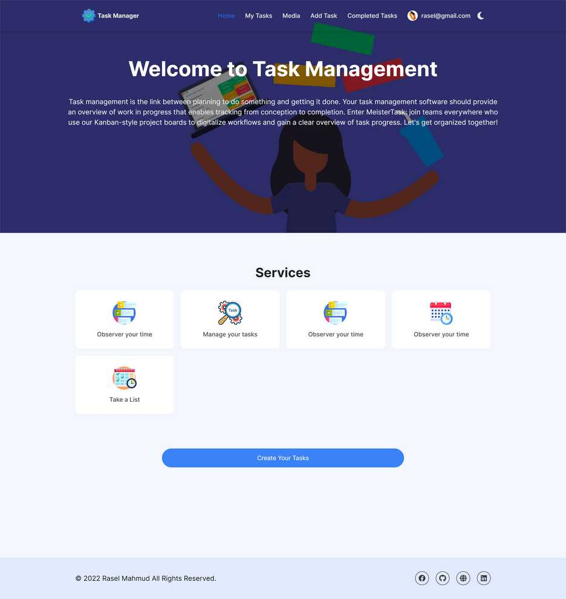
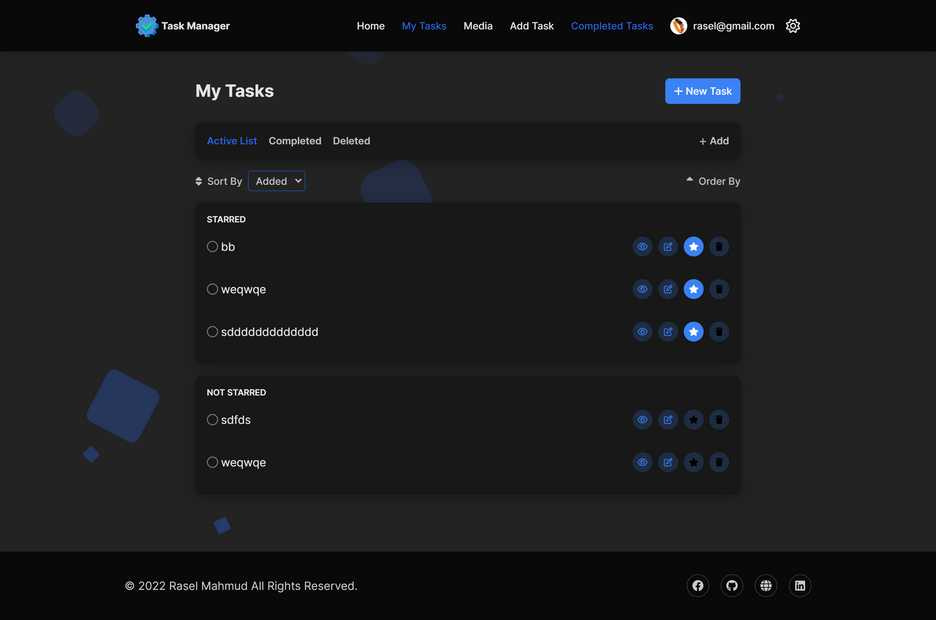

# Task management (Backend)

## A simple dynamic task management app

### Github Repo Client : https://github.com/rasel-mahmud-dev/task-manager-frontend
### Github Repo Backend: https://github.com/rasel-mahmud-dev/task-manager-backend

### Live site: http://task-manager3.web.app

## Packages uses.
- Typescript
- Expressjs
- cors
- bcryptjs
- dotenv
- jwt(jsonwebtoken)
- mongodb

## Functional requirement.
- multiple user based task management
- user can create account by google or email password
- my tasks route show all current user tasks
- only logged user can check task detail

## Database.
- Mongodb (Native)

## Preview of my tasks

## Preview of Homepage

## Preview Dark

